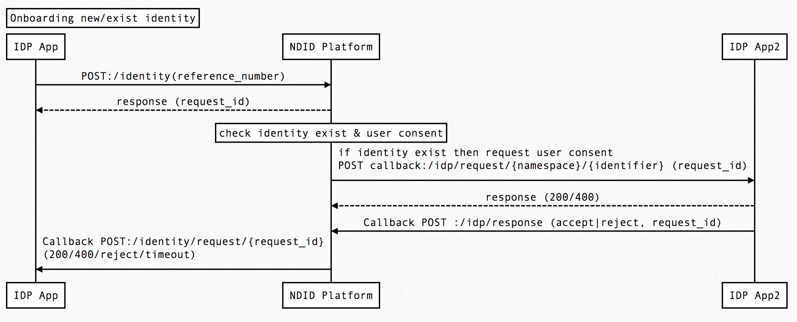

# Onboarding Story
<div markdown="1" class="flash mb-3 flash-warn">

**Disclaimer:** The purpose of this page is to illustrate the Onboarding scenario outlined in the [quick overview](/#quick-overview) using concrete examples, to help make it easier to grasp how the platform works. This document is **not** the definitive source of information, just a learning aid. Please look at the [whitepaper](https://docs.google.com/document/d/1SKydNM-Nyox62m3vuvYgFYCr8ABVQV8RhjwiMjdCpQ8/edit#heading=h.qf2lmu8vfgym) for the full description of the platform.

</div>

```yaml 
# Reference ID is used in case of communication error between IDP and platform,
# to prevent the same request from being executed twice.
reference_id: "e3cb44c9-8848-4dec-98c8-8083f373b1f7"

# Synchronous mode:
# true - Wait until transaction is finished before returning.
# false - Return immediately with `request_id`.
synchronous: false

# If provided, this URL will be invoked when request status is updated.
callback_url: "https://<idp-webservice>/webhook"

#The namespace of the ID (i.e. ID Card, Passport, etc)
"namespace": "citizenid"


#Identifier : The unique identifier under the namespace (i.e. ID Card Number, Passport Number, etc). 
#The list of {namespace, Identifier} pair can be group together to identify an individual.
"identifier": "1234567890123"


#Secret is a salt. Different ns/id accessor id will result in different secret
#Discrete logarithms > 128 bit
"secret": "<magic>"


#Accessor method to allow zero-knowledge proof of consent
# 1 device 1 accessor value
# accessor_id > index of accessor_key > local ?
# accessor_key > pub key
#Example
"accessor_type": "RSA-2048"
"accessor_key": "AAAAB3NzaC1yc2EAAAADAQABAAAB…"
"accessor_id": "acc_f328-53da-4d51-a927-3cc6d3ed3feb"

# Identity Assurance Level. Assurance level of KYC process.
# Examples:
#   IAL1 = self-asserted. e.g. email/facebook account
#   IAL2 = rudimentary identity verification. e.g. copy of id card
#   IAL3 = more strict verification, utilizing biometric data
"ial": "2.3"

#Adding new Identifier data
#[{new namespace, new identifier}] 
"identifiers": [
    "passport|AA123456789","mobile|0831111111"
  ]
```

## scenario#1 : onboarding new/exist identity 
> 

- IDP→Platform : POST: /identity(body) 
```yaml 
{   
"reference_id":"e3cb44c9-8848-4dec-98c8-8083f373b1f7",
"callback_url": "https://<rp-webservice>/identity/request/",
"namespace": "citizenid",
"identifier": "1234567890123",
"secret": "<magic>",
"accessor_type": "RSA-2048",
"accessor_key": "AAAAB3NzaC1yc2EAAAADAQABAAAB…",
"accessor_id": "acc_f328-53da-4d51-a927-3cc6d3ed3feb",
"ial": "2.3"
}
```
The API validates the request, generates a request ID and returns a response:
```yaml
200 OK 
request_id: 'ef6f4c9c-818b-42b8-8904-3d97c4c520f6'
```

- response code
```yaml
200  Successful: return request_id
202 "request_id" Request Accepted – Async processing, please check back or wait for response at Callback URL
400  Accessor error 
403  Error: Identity already exist
```

 - This request_id can be used to check the status of request through [GET /identity/requests/{request_id}](https://app.swaggerhub.com/apis/ndid/identity/1.0#/default/get_request_status) API.
 

 - **IDP** will check if ns/id is not existing will onboarding identity unless will request user consent.
 - After get user consent, **IDP** will onboarding or reject identity and response at callback url [POST /identity/request/{identifier}] API. 

**POST /identity/request/ef6f4c9c-818b-42b8-8904-3d97c4c520f6**
```yaml 
*response code*
201 Status Create/Update Accepted
400 Status User reject
408 Status Timeout
```


## scenario#2 : adding new accessor
> 
- IDP->Platform : POST /identity/citizenid/1234567890123/accessors
```yaml
{
"accessor_type": "RSA-2048",
"accessor_key": "AAAAB3NzaC1yc2EAAAADAQABAAAB…",
"accessor_id": "acc_f328-53da-4d51-a927-3cc6d3ed3feb"
}
```

- The API validates the request, generates a request ID and returns a response:
```yaml
200 OK 
request_id: 'ef6f4c9c-818b-42b8-8904-3d97c4c520f6'
```

- response code
```yaml
200  Successful: return request_id
202 "request_id" Request Accepted – Async processing, please check back or wait for response at Callback URL
400  Accessor error 
403  Error: Identity already exist
```
- After get user consent, IDP can associate accessor_method to {namespace,identifier}. Return fail if {namespace,identifier} does not exist at callback url [POST /identity/request/{identifier}] API. 

**POST /identity/request/ef6f4c9c-818b-42b8-8904-3d97c4c520f6**
```yaml 
*response code*
201 Status Create/Update Accepted
400 Status User reject
408 Status Timeout
```


## scenario#3 : addding new identifier 
> 
- IDP/RP/AS->Platform : POST /identity/{namespace}/{identifier}
```yaml
{
"identifiers": [
    "passport|AA123456789","mobile|0831111111"
  ]
}
```


- The API validates the request, generates a request ID and returns a response:
```yaml
200 OK 
request_id: 'ef6f4c9c-818b-42b8-8904-3d97c4c520f6'
```

- response code
```yaml
200  Successful: return request_id
202 "request_id" Request Accepted – Async processing, please check back or wait for response at Callback URL
400  Accessor error 
403  Error: Identity already exist
```
- After get user consent, IDP can new namespace, newidentifier. Return fail if {namespace,identifier} does not exist at callback url [POST /identity/request/{identifier}] API. 

**POST /identity/request/ef6f4c9c-818b-42b8-8904-3d97c4c520f6**
```yaml 
*response code*
201 Status Create/Update Accepted
400 Status User reject
408 Status Timeout
```
<div class="flash mb-3 flash-warn">
  @todo #1 which organization should have the right authority to add new namespace 
</div>


