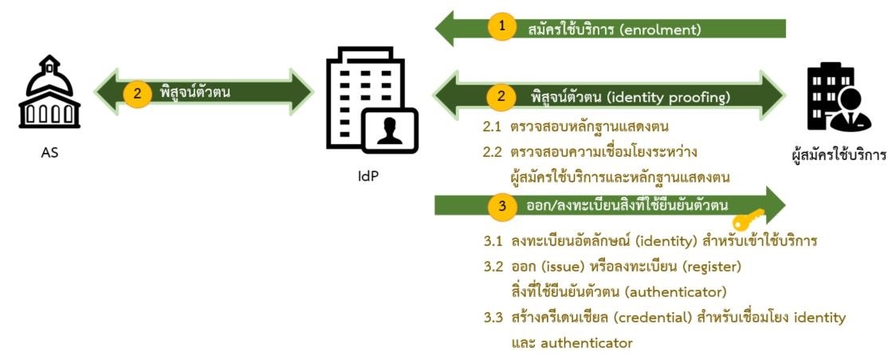
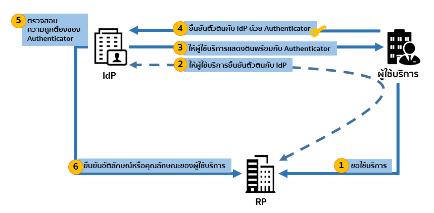

Development hub for Thailand National Digital ID platform.

| Title                   | URL                                           |
| ----------------------- | --------------------------------------------- |
| **Official site**       | <http://www.digitalid.or.th/>                 |
| **TEDxChiangMai Talk**  | <https://www.youtube.com/watch?v=E8HHNRRlsoo> |
| **GitHub organization** | <https://github.com/ndidplatform>             |
| **HTTP API schema**     | <https://app.swaggerhub.com/apis/NDID/>       |
| **Facebook page**       | <https://www.facebook.com/NationalDigitalID/> |
| **Whitepaper**          | <https://goo.gl/v4Cfpe>                       |
| **Slack**               | <https://bit.ly/2MNDyLI>                      |

## Architecture overview

**Recommended reading:** For newcomers, we highly recommend that you [watch the TEDxChiangMai talk](https://www.youtube.com/watch?v=E8HHNRRlsoo) which describes the importance and benefits of having a digital ID infrastructure in Thailand, and read the [Digital Identity Guideline for Thailand – Overview and Glossary (DRAFT)](https://standard.etda.or.th/?p=8577) document to understand the overall process of the Digital ID model.

From the whitepaper:

> The Digital Identity Platform is intended to provide a flexible and highly
> secured method of self-identification for any Thai citizen personal. The
> platform must be able to leverage any reliable identity the user currently
> holds. Examples of reliable identity could be, for example, Citizen Id, Bank
> Accounts, Passport Number, Tax ID, Biometric Data.
>
> The users will interact with a **Relying Party (RP)** to receive services –
> offline or online. In order to successfully receive the services, the users
> are obliged to prove their identities in the form of online or offline
> identity confirmation with any available **Identity Provider (IdP)** who hold
> their identities.
>
> An **Authoritative Source (AS)** is considered as Source of Truth for any
> information relevant to the users. There are currently multiple Source of
> Truth entities. Each entity may keep one or multiple classification of user
> information. The RP can request more user information from AS, if necessary,
> under the permission granted by the users.

There are 2 main processes when using NDID:

- **Enrolment and identity proofing** (getting a digital ID): The user first needs to enrol with an **Identity Provider (IdP)** to get started. They will verify your identity (identity proofing) and then provide you a **digital identity** along with an **authenticator** that you use to verify your credential. The user can enrol with multiple IdPs for extra security.

  <figure>
    
    <figcaption markdown="span">
      Enrolment process. Source: [Digital Identity Guideline for Thailand – Overview and Glossary (DRAFT)](https://standard.etda.or.th/?p=8577)
    </figcaption>
  </figure>

- **Authentication and data access authorization** (using your digital ID): This happens when you use a service that requires authentication using digital ID. They (the **Relying Party (RP)**, who offers you service) will ask the IdP, who will in turn ask you to provide your credentials (authentication) using your authenticator and allow the RP to access the data (data access authorization) which will be provided by an **Authoritative Source (AS).**

  <figure>
    
    <figcaption markdown="span">
      Authentication process. Source: [Digital Identity Guideline for Thailand – Overview and Glossary (DRAFT)](https://standard.etda.or.th/?p=8577)
    </figcaption>
  </figure>

**Recommended reading:** [บทความเกี่ยวกับแนวคิดพื้นฐานในความแตกต่างของ Identity Proofing และ Authentication รวมทั้งความเชื่อมโยงของสองเรื่องนี้ที่เป็นเรื่องพื้นฐานของ Digital ID](https://narudomr.blogspot.com/2018/02/identity-proofing-authentication.html)

<figure>
  
  <figcaption markdown="span">
    Digital ID Model. Source: [Digital Identity Guideline for Thailand – Overview and Glossary (DRAFT)](https://standard.etda.or.th/?p=8577)
  </figcaption>
</figure>

## Quick overview

This section gives you a quick overview of the digital identity platform, illustrated through a simple scenario.

Let's consider a use case where you're applying for a Visa at an embassy. They need your identity and bank statement. Without a digital identity platform, this would require a lot of paperwork.

**Note:** This is a concrete scenario designed to help readers understand the system more easily, but the platform is _very flexible_, supporting vast amount of use cases.

With a digital identity platform, this process is much simpler.
First, we define these participants:

- **User**, in this example, the applicant.
- **Relying Party (RP)** relies on the NDID platform to provide service to users. In this example, the embassy.
- **Identity Provider (IdP)** holds the identity of the user, and is able to prove the identity the user.
- **Authoritative Source (AS)** holds the user’s information, such as bank statement. In this example, the bank.
- **The NDID platform**
    - A decentralized app with nodes running on each RP, IdP, and AS, connecting them together.
    - Exposing an HTTP-based API to enable integration with each party.
    - Transaction logs (without ID or private information, but contains zero-knowledge proof to verify the transaction) are recorded on the blockchain ([Tendermint](https://tendermint.com/)).
    - Private information (ID information, data from AS) is communicated between nodes securely through [NSQ](http://nsq.io/).

**Note:** The following diagram treats the NDID platform as a black box, only showing the interaction between parties (Users, RP, IdP and AS). For more technical information about how the platform works and communicate securely under the hood, please see the [technical overview](technical-overview.html).

```mermaid
sequenceDiagram
    participant User
    participant RP
    participant Platform
    participant IdP
    participant AS
    User->>RP: Use service
    RP->>User: Please provide ID
    User->>RP: 1-2345-67890-12-3
    RP->>+Platform: POST /rp/requests/citizenid/1234567890123
    Platform-->>-RP: 200, request_id=ef6f4c9c-818b-...
    Note over User,Platform: RP can provide webhook (callback URL) to get updated about the transaction status. RP can also poll the platform for the request status.
    Platform->>+IdP: /idp/request/citizenid/1234567890123
    IdP-->>-Platform: 200 (request accepted)
    IdP->>User: Asks user to authenticate and allow RP to retrieve the bank statement from AS.
    Note over RP,IdP: Since ID verification can take from few minutes to several days, ID verification is done in an async manner.
    User-->>IdP: Accepts the consent request
    IdP->>Platform: /idp/response
    Platform->>RP: Callback request status update (state=CONFIRMED)
    Note over RP,IdP: At this point, the user has confirmed their identity. But the bank statement is yet to be retrieved.
    Platform->>+AS: /service/citizenid/1234567890123
    AS-->>-Platform: Bank statement
    Platform->>RP: Callback request status update (state=COMPLETED)
    Note over User,Platform: At this point, data requested from AS is now available for RP to use.
    RP->>+Platform: /rp/requests/data/ef6f4c9c-818b-...
    Platform-->>-RP: 200 (Reply with data from AS)
```
